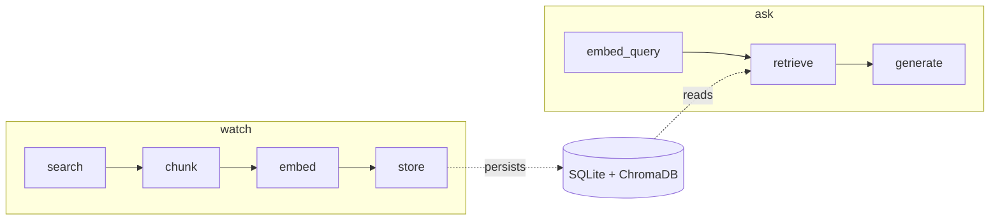

# Tech Watch Agent

CLI agent that ingests web articles on a topic and answers questions with source citations (RAG).

## Workflow

Two independent LangGraph pipelines:



- **Ingest** (`watch`): Tavily search → chunk text → embed chunks → write to SQLite (articles) + ChromaDB (vectors).
- **Retrieve** (`ask`): embed question → top-K similar chunks from ChromaDB → LLM answers using only that context.

## Stack

| Layer | Tool |
|---|---|
| Agent | LangGraph |
| LLM | LM Studio (`openai/gpt-oss-20b`) |
| Embeddings | LM Studio (`text-embedding-nomic-embed-text-v1.5`, 768d) |
| Search | Tavily |
| Vectors | ChromaDB |
| Relational | SQLite |

## Setup

1. Open LM Studio. Load both models. Start the server on port 1234. Verify:
   ```bash
   curl http://localhost:1234/v1/models
   ```
2. Add your Tavily key to `.env`:
   ```
   TAVILY_API_KEY=tvly-...
   ```
3. Install:
   ```bash
   python -m venv .venv
   source .venv/bin/activate
   pip install -r requirements.txt
   ```

## Usage

Ingest articles on a topic:
```bash
python cli.py watch "AI agents"
```
Output:
```
Ingested 5 articles (37 chunks) for topic: 'AI agents'
```

Ask a question against the ingested corpus:
```bash
python cli.py ask "what is an AI agent?"
```
Output:
```
An AI agent is a system that perceives its environment and takes
actions to achieve goals [source: 3f9a...]. Modern agents typically
combine an LLM with tools and memory [source: 7c12...].
```

If nothing has been ingested yet:
```
No relevant context found. Run `watch <topic>` first.
```

## Project layout

```
tech_watch_agent/
├── cli.py                 # entry point
├── config.py              # paths, model names, chunk size, top_k
├── core/
│   ├── models.py          # Source / Article / Tag / Chunk
│   ├── ingest_graph.py    # search → chunk → embed → store
│   └── retrieve_graph.py  # embed_query → retrieve → generate
├── adapters/              # only layer talking to the outside world
│   ├── search.py          # Tavily
│   ├── embedder.py        # LM Studio embeddings
│   ├── llm.py             # LM Studio chat
│   └── store.py           # SQLite + ChromaDB
└── data/                  # gitignored — DBs live here
```
