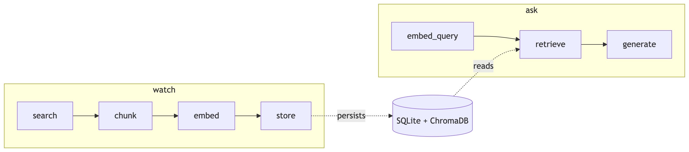
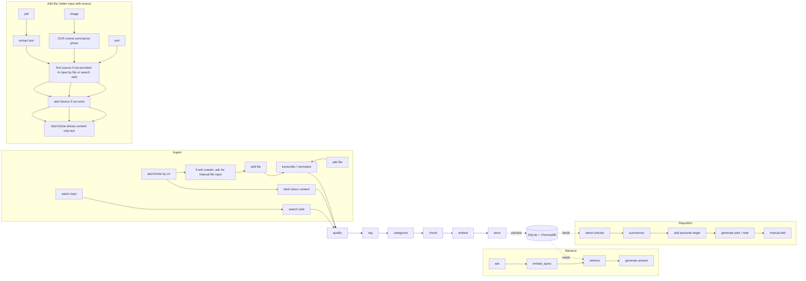

# Tech Watch Agent

CLI agent that ingests web articles on a topic and answers questions with source citations (RAG).

> **Status — work in progress.** This is the TP milestone: ingest + RAG only. The full feature set (source legitimacy scoring, auto-categorization, manual tag editing, value-added republishing, web UI) lands in the September 2026 milestone. See [Roadmap](#roadmap) below.

## Workflow

Two independent LangGraph pipelines:





- **Ingest** (`watch`): Tavily search → chunk text → embed chunks → write to SQLite (articles) + ChromaDB (vectors).
- **Retrieve** (`ask`): embed question → top-K similar chunks from ChromaDB → LLM answers using only that context.

## Stack

| Layer | Tool |
|---|---|
| Agent | LangGraph |
| LLM | LM Studio (`openai/gpt-oss-20b`) |
| Embeddings | LM Studio (`text-embedding-nomic-embed-text-v1.5`, 768d) |
| Search | Tavily |
| Vectors | ChromaDB |
| Relational | SQLite |
| API | FastAPI + Uvicorn |


## Install & Setup

1. Open LM Studio. Load both models. Start the server on port 1234. Verify:
   ```bash
   curl http://localhost:1234/v1/models
   ```
2. Add your Tavily key to `.env`:
   ```env
   TAVILY_API_KEY=tvly-...
   ```
3. Install:
   ```bash
   python -m venv .venv
   source .venv/bin/activate
   pip install -r requirements.txt
   ```

## Usage

### Run the local API backend

Start the FastAPI backend in one terminal:

```bash
python -m uvicorn api:app --reload
```

`api:app` means: load the `app` FastAPI object from `api.py`. `--reload` restarts the server after Python file changes; use it for local development only.

The API is available at:

- `http://127.0.0.1:8000/health` - server health check.
- `http://127.0.0.1:8000/docs` - interactive Swagger UI.
- `POST /watch` - runs `watch topic -> search web -> chunk -> embed -> store`.
- `POST /ask` - runs `ask <question> -> embed_query -> retrieve -> generate answer`.
- `GET /articles` - lists saved articles for the web app.
- `GET /articles/{article_id}` - returns an article with its source metadata and tags.
- `PATCH /articles/{article_id}` - updates reviewable metadata: `title`, `summary`, `category`, and `tags`.
- `DELETE /articles/{article_id}` - permanently removes an article, its tag links, and its retrieval vectors.

The CLI calls the shared services directly, so it does not require Uvicorn to be running.

### Run the React web app

In a second terminal, start the Vite development server:

```bash
cd frontend
npm install
npm run dev
```

Open the URL printed by Vite, normally `http://127.0.0.1:5173/`. Vite proxies `/watch`, `/ask`, and `/articles` to FastAPI on port 8000, so both terminals must be running.

The old FastAPI-served `web/` frontend remains in the repository temporarily; the active development frontend is `frontend/`.

### Use the CLI

Ingest articles on a topic:
```bash
python cli.py watch "AI agents"
```
Output:
```
Ingested 5 articles (37 chunks) for topic: 'AI agents'
```

Ask a question against the ingested corpus:
```bash
python cli.py ask "what is an AI agent?"
```
Output:
```
An AI agent is a system that perceives its environment and takes
actions to achieve goals [source: 3f9a...]. Modern agents typically
combine an LLM with tools and memory [source: 7c12...].
```

If nothing has been ingested yet:
```
No relevant context found. Run `watch <topic>` first.
```

## Roadmap

**Done:**
- `watch <topic>` — Tavily search, chunking, embedding, dual storage.
- `ask <question>` — vector retrieval + LLM answer with source ids.

**Coming soon:**
- Source legitimacy / credibility scoring (`Source.credibility_score` is wired in the schema but always `None` today).
- Source summaries / editorial focus metadata.
- Auto-categorization of articles (PRO / PERSO).
- Auto-tagging beyond the topic keyword.
- Article summaries.
- Manual tag editing.
- Capture pipelines (web form, bot, dictaphone).
- Value-added republishing.
- Web UI on top of the FastAPI endpoints.

The data model already reserves the fields for the September features — no rewrite needed, only additive nodes/agents.

## Project layout

```
tech_watch_agent/
├── api.py                 # FastAPI HTTP entry point
├── cli.py                 # entry point
├── config.py              # paths, model names, chunk size, top_k
├── services/
│   └── agent_service.py   # shared watch_topic / ask_question entry points
├── frontend/              # Vite + React development frontend
│   ├── public/assets/     # chat-box artwork
│   └── src/               # React components and styles
├── web/                   # light-themed frontend served by FastAPI
│   ├── index.html
│   ├── styles.css
│   ├── app.js
│   └── assets/chatbox.png # provided chat-box artwork
├── core/
│   ├── models.py          # Source / Article / Tag / ArticleTag / Chunk
│   ├── ingest_graph.py    # search → chunk → embed → store
│   └── retrieve_graph.py  # embed_query → retrieve → generate
├── adapters/              # only layer talking to the outside world
│   ├── search.py          # Tavily
│   ├── embedder.py        # LM Studio embeddings
│   ├── llm.py             # LM Studio chat
│   └── store.py           # SQLite + ChromaDB
└── data/                  # gitignored — DBs live here
```

## Data Dictionary

### Enums

- `SourceType`: `blog`, `article`, `video`, `podcast`, `social`, `other`
- `Category`: `unsorted`, `pro`, `perso`
- `OriginalType`:`text`,`image`,`pdf`

### Entities

#### `Source`

| Field | Type | Required | Notes                                                                               |
|---|---|---|-------------------------------------------------------------------------------------|
| `id` | `str` | Yes | Unique identifier for the source                                                    |
| `name` | `str` | Yes | Name of the source, if type is social account, it should be plateform_id, ig X_haha |
| `url` | `HttpUrl` | Yes | Canonical URL of the source                                                         |
| `type` | `SourceType` | Yes | Type of source such as article site, blog, video, or social account                 |
| `credibility_score` | `float \| None` | No | Credibility score assigned to the source                                            |
| `source_summary` | `str \| None` | No | Short description of the source and its editorial focus                             |

#### `Article`

| Field           | Type              | Required | Notes                                                                         |
|-----------------|-------------------|----------|-------------------------------------------------------------------------------|
| `id`            | `str`             | Yes      | Unique identifier for the article                                             |
| `source_id`     | `str`             | Yes      | Identifier of the source that published the article                           |
| `url`           | `HttpUrl \| None` | No       | Canonical URL of the article, could be none if input is file added without url |
| `title`         | `str`             | Yes      | Title of the article, or extracted/summarized from file                       |
| `content`       | `str`             | Yes      | Full article content used for chunking and retrieval                          |
| `fetched_at`    | `datetime`        | Yes      | Date and time when the article was ingested                                   |
| `category`      | `Category`        | Yes      | unsorted, pro, perso                                                          |
| `n_tags`        | `int`             | Yes      | Number of tags currently linked to the article                                |
| `summary`       | `str \| None`     | No       | Short summary of the article                                                  |
| `original_type` | `OriginalType \| None`     | No       | `text`(all text file like txt, md etc),`image`,`pdf`, None if it's not manuel added 

#### `Tag`

| Field | Type | Required | Notes                                  |
|---|---|---|----------------------------------------|
| `id` | `str` | Yes | Unique identifier for the tag          |
| `name` | `str` | Yes | Tag name                               |
| `created_at` | `datetime` | Yes | Date and time when the tag was created |

#### `ArticleTag`

| Field | Type | Required | Notes |
|---|---|---|---|
| `article_id` | `str` | Yes | Identifier of the linked article |
| `tag_id` | `str` | Yes | Identifier of the linked tag |

#### `Chunk`

| Field | Type | Required | Notes |
|---|---|---|---|
| `id` | `str` | Yes | Unique identifier for the chunk |
| `article_id` | `str` | Yes | Identifier of the article the chunk comes from |
| `text` | `str` | Yes | Text content of the chunk |
| `position` | `int` | Yes | Relative position of the chunk within the article |

### Relationships

- `Source 1 -> N Article` via `Article.source_id`
- `Article 1 -> N Chunk` via `Chunk.article_id`
- `Article N -> N Tag` via `ArticleTag(article_id, tag_id)`
- `Article.n_tags` is a denormalized counter derived from `ArticleTag`
