# Tech Watch Agent

Local knowledge-library agent for collecting articles, enriching them with LLM
metadata, and answering questions with source citations (RAG).

> **Status — active development.** Search and manual-content ingest,
> source qualification, tags, categories, the REST API, the React library UI,
> and locally saved publication drafts are available. Generated metadata is advisory and can be edited through
> `PATCH /articles/{article_id}`. The library's **Manual edit** screen also
> shows the retained raw input and source-verification result beside the
> editable normalized article.

## Workflow

The implemented LangGraph paths are ingest (web search or supplied content),
retrieval, and draft publishing. Publishing ends at a locally saved, manually
editable draft: this application never posts to an external platform.

```mermaid
flowchart LR
    subgraph Ingest["Ingest"]
        A[watch topic] --> B[search web]

        C[add content] --> D[paste text]
        C --> E[add file]
        C --> F[add by url]

        D --> N[transcribe / normalize]
        E --> G{file type}
        G -- text --> AF[transcribe / normalize]
        G -- pdf --> H[extract text]
        G -- image --> I[OCR]
        H --> AF
        I --> AF
        AF --> AG{source URL provided?}
        AG -- yes --> AH[verify source]
        AG -- no --> AI[find source]
        AH --> AJ[add Source if verified]
        AI --> AJ

        F --> J[inspect content type]
        J -- text/html --> K[fetch direct content]
        J -- application/pdf --> AM[download]
        J -- image/* --> AN[download]
        AM --> H
        AN --> I
        K --> AL{content available?}
        AL -- yes --> N
        AL -- no / anti crawler --> L[ask for manual file input]
        L --> E
    end

    B --> O[qualify]
    N --> O
    AJ --> O

    O --> P[tag]
    P --> Q[categorize]
    Q --> R[chunk]
    R --> S[embed]
    S --> T[store]

    subgraph Retrieve["Retrieve"]
        U[ask <question>] --> V[embed_query]
        V --> W[retrieve]
        W --> X[generate answer]
    end

    subgraph Publish["Republish"]
        Y[describe sharing intent] --> YA[select relevant library sources]
        YA --> YB[optional web enrichment]
        YB --> Z[summarize]
        Z --> AA[add personal angle]
        AA --> AB[generate post / note]
        AB --> AC[human review / edit]
    end

    T -. persists .-> AD[(SQLite + ChromaDB)]
    AD -. reads .-> W
    AD -. feeds .-> Y

```




- **Ingest** (`watch`): Tavily search → qualify source → generate tags and category → chunk text → embed chunks → write to SQLite (articles) + ChromaDB (vectors). Text, files, and URLs follow the same enrichment, chunking, embedding, and storage path after extraction.
- **Retrieve** (`ask`): embed question → retrieve relevant chunks from ChromaDB → LLM answers using only that context. If the library has no sufficiently relevant context, the agent searches and ingests material for the question once, then retries retrieval.
- **Draft publish** (`drafts`): describe what you want to share → semantically select relevant saved articles → optionally enrich with current web sources → summarize → apply the author's supplied personal angle → generate a post or note → save it in SQLite for human review. English is the default language, with French and Chinese suggestions; audiences, objectives, tones, and platform conventions (LinkedIn, X / Twitter, RedNote, or neutral) remain editable suggestions.


## Stack

| Layer | Tool |
|---|---|
| Agent | LangGraph |
| LLM | LM Studio (`openai/gpt-oss-20b`) |
| Embeddings | LM Studio (`text-embedding-nomic-embed-text-v1.5`, 768d) |
| Search | Tavily |
| Vectors | ChromaDB |
| Relational | SQLite |
| API | FastAPI + Uvicorn |


## Install & Setup

1. Open LM Studio, load a chat model and an embedding model, then start its
   server on port 1234. The default model identifiers are
   `openai/gpt-oss-20b` and `text-embedding-nomic-embed-text-v1.5`; override
   them with the `LMSTUDIO_MODEL` and `LMSTUDIO_EMBEDDING_MODEL` variables in
   `.env` when needed. Verify the server:
   ```bash
   curl http://localhost:1234/v1/models
   ```
2. Add your Tavily key to `.env`:
   ```env
   TAVILY_API_KEY=tvly-...
   ```
3. Install:
   ```bash
   python -m venv .venv
   source .venv/bin/activate
   pip install -r requirements.txt
   ```
4. To ingest images with OCR, install Tesseract:
   ```bash
   brew install tesseract
   ```

Image extraction defaults to OCR. Add this to `.env` only when you want to be explicit:

```env
IMAGE_EXTRACTION_MODE=ocr
```

`IMAGE_EXTRACTION_MODE=vision` is reserved for the future multimodal LLM extractor and is not available yet.

## Usage

### Run the local API backend

Start the FastAPI backend in one terminal:

```bash
python -m uvicorn api:app --reload
```

`api:app` means: load the `app` FastAPI object from `api.py`. `--reload` restarts the server after Python file changes; use it for local development only.

The API is available at:

- `http://127.0.0.1:8000/health` - server health check.
- `http://127.0.0.1:8000/docs` - interactive Swagger UI.
- `POST /watch` - searches Tavily, qualifies sources, generates tags and a category, then chunks, embeds, and stores matching articles.
- `GET /discover/topics?categories=tech_code&categories=ai_automation` - returns recent, clickable news topics for selected technical-watch categories. The default categories are Tech & Code and AI & Automation.
- `POST /ask` - retrieves relevant chunks and answers from them. When context is missing or insufficient, it searches Tavily, ingests the question topic, then retries once.
- `GET /articles?limit=10&offset=0` - returns paginated saved articles; the dashboard uses 10, and the all-articles page uses 20.
- `GET /articles/{article_id}` - returns an article with its source metadata and tags.
- `PATCH /articles/{article_id}` - updates `title`, normalized `content`, `summary`, `category`, and `tags`. Content edits replace the article's retrieval chunks.
- `DELETE /articles/{article_id}` - permanently removes an article, its tag links, and its retrieval vectors.
- `GET /drafts` - lists locally saved, unpublished drafts.
- `POST /drafts` - generates and saves a draft from a sharing `intent` plus its editorial brief (`format`, `platform`, `language`, `audience`, `objective`, `tone`, and `personal_angle`). It automatically selects relevant library content and, by default, enriches it with web sources before drafting.
- `GET /drafts/{draft_id}` - returns one draft, including the automatically selected source articles.
- `PATCH /drafts/{draft_id}` - saves manual edits to the content and editorial brief; no external publication occurs.
- `POST /drafts/{draft_id}/regenerate` - replaces the draft body from its current source selection and brief after explicit user action.
- `POST /content/text` - ingests pasted text through `transcribe / normalize`.
- `POST /content/file` - ingests text, PDF, or image uploads, then verifies a provided source URL or finds a candidate source.
- `POST /content/url` - inspects the URL `Content-Type`, then ingests HTML, text, PDF, or image content directly.
- `POST /content/youtube` - retrieves a public YouTube caption transcript and stores it as searchable content.
- `POST /content/podcast` - resolves a public podcast transcript or RSS audio enclosure from an episode URL, then stores normalized transcript text.
- `GET /input-assets/{asset_id}/file` - returns a retained raw upload for manual review.

### Add media as searchable content

YouTube ingestion retrieves the video's public captions. The video remains the
article URL, the channel is stored as a `video` source, and the normalized
caption text becomes the searchable content:

```bash
curl -X POST http://127.0.0.1:8000/content/youtube \
  -H 'Content-Type: application/json' \
  -d '{"url":"https://www.youtube.com/watch?v=VIDEO_ID"}'
```

For a podcast, paste the episode URL—even a Spotify or Apple Podcasts URL. The
agent first looks for a publisher-provided Podcasting 2.0/RSS transcript, then
for a public RSS audio enclosure to transcribe locally with Faster-Whisper. The
first transcription downloads the configured Whisper model (`base` by default)
and can take several minutes for a long episode. Paste transcript text or link
a transcript page only when you want to bypass automatic resolution.

```bash
curl -X POST http://127.0.0.1:8000/content/podcast \
  -H 'Content-Type: application/json' \
  -d '{"url":"https://open.spotify.com/episode/EPISODE_ID"}'
```

Automatic transcription only uses publicly reachable publisher audio. An error
is returned for Spotify-exclusive, subscriber-only, DRM-protected, or otherwise
unresolvable episodes. Configure `WHISPER_MODEL` (default `base`) or
`MAX_PODCAST_AUDIO_BYTES` (default 750 MB) in `.env` if needed.

Discovery only returns results from the per-category domain allowlist in
[`discovery_sources.json`](discovery_sources.json). Edit that versioned file to
add, remove, or replace trusted publishers without changing application code.
The non-default categories use a similarly conservative mix: Reuters, MIT
Technology Review, and MIT Sloan Management Review for product/business;
Nature, Science, NIST, NIH, and IEEE Spectrum for research; Figma, Adobe,
Google Design, and AIGA for design; OECD, the European Commission, Pew, and
Brookings for culture/policy; and UNESCO, OECD, MIT Open Learning, MIT Sloan,
and the U.S. Department of Education for learning and work.

The Tech & Code allowlist is oriented around engineering practice rather than
general product announcements: Cloudflare, Netflix, Shopify, Slack, LinkedIn,
Stripe, CNCF, InfoQ, IEEE Spectrum, ACM Communications, and Martin Fowler.

All LLM instructions live in [`prompts.json`](prompts.json): categorization,
tagging, source qualification, retrieval, and the three draft-publishing
stages. Edit the relevant template and
restart the backend to apply it. Template fields such as `{title}`, `{content}`
and `{question}` are populated by the application; keep them intact. Literal
JSON braces in a template must be doubled (`{{` and `}}`).

The CLI calls the shared services directly, so it does not require Uvicorn to be running.

### Run the React web app

In a second terminal, start the Vite development server:

```bash
cd frontend
npm install
npm run dev
```

Open the URL printed by Vite, normally `http://127.0.0.1:5173/`. Vite proxies `/watch`, `/discover`, `/ask`, `/articles`, `/drafts`, `/content`, and `/input-assets` to FastAPI on port 8000, so both terminals must be running. Use the **Drafts** page to reopen and manually edit generated work; it contains no publish button or platform integration.

The old FastAPI-served `web/` frontend remains in the repository temporarily; the active development frontend is `frontend/`.

### Use the CLI

Ingest articles on a topic:
```bash
python cli.py watch "AI agents"
```
Output:
```
Ingested 5 articles (37 chunks) for topic: 'AI agents'
```

Ask a question against the ingested corpus:
```bash
python cli.py ask "what is an AI agent?"
```
Output:
```
An AI agent is a system that perceives its environment and takes
actions to achieve goals [source: 3f9a...]. Modern agents typically
combine an LLM with tools and memory [source: 7c12...].
```

If the library does not yet contain enough relevant material, `ask` searches
Tavily and ingests results for the question automatically before answering.
The first request for a new topic can therefore take longer and requires both
Tavily and LM Studio to be available.

### Correct categories on existing articles

New content is categorized during ingest. The categorizer command is the way to
apply an improved categorization prompt to articles already stored in SQLite.
It calls LM Studio directly; Uvicorn does not need to be running.

Start with a no-write pass for only uncategorized items:

```bash
python cli.py categorize --dry-run
```

Apply those decisions:

```bash
python cli.py categorize
```

To correct every existing category after changing the categorizer, preview the
bulk run, then repeat it without `--dry-run`:

```bash
python cli.py categorize --all --dry-run
python cli.py categorize --all
```

`--all` can overwrite categories you set manually, including changing one to
`inbox` when the model cannot choose a category. Use it only when that is
intended. The dry run verifies that LM Studio can process the library and
reports how many rows would change; it does not display each proposed label.
For article-by-article review or correction, use `PATCH /articles/{article_id}`
with a valid category identifier.

### Qualify existing sources

Evaluate existing source URLs without changing articles or vectors:

```bash
python cli.py qualify --dry-run
python cli.py qualify
```

The command evaluates each canonical URL once, then updates duplicate source rows.

### Tag existing articles

Generate additional LLM tags for every saved article. Existing topic and manual
tags are preserved:

```bash
python cli.py tag --dry-run
python cli.py tag
```

To replace outdated automatic tags instead of merging new ones, review the
result first, then run the replacement. This also removes any manual/topic tags:

```bash
python cli.py tag --replace --dry-run
python cli.py tag --replace
```

## Roadmap

Implemented capabilities include web search, pasted text/file/URL capture, YouTube captions, RSS-first podcast
transcript capture with local transcription fallback, OCR
for images, source qualification, automatic categories and tags, manual article
metadata updates through the API, the React library UI, and RAG retrieval.

Planned capabilities include value-added republishing, richer article/source
summaries, and additional capture channels such as bots or dictation.

## Project layout

```
tech_watch_agent/
├── api.py                 # FastAPI HTTP entry point
├── cli.py                 # entry point
├── config.py              # paths, model names, chunk size, top_k
├── prompts.json           # editable LLM prompt templates
├── services/
│   └── agent_service.py   # shared watch_topic / ask_question entry points
├── frontend/              # Vite + React development frontend
│   ├── public/assets/     # chat-box artwork
│   └── src/               # React components and styles
├── web/                   # light-themed frontend served by FastAPI
│   ├── index.html
│   ├── styles.css
│   ├── app.js
│   └── assets/chatbox.png # provided chat-box artwork
├── core/
│   ├── models.py          # Source / Article / InputAsset / Tag / ArticleTag / Chunk
│   ├── ingest_graph.py    # search → qualify → tag → categorize → chunk → embed → store
│   ├── content_ingest_graph.py # supplied content → tag → categorize → chunk → embed → store
│   └── retrieve_graph.py  # embed_query → retrieve → generate
├── adapters/              # only layer talking to the outside world
│   ├── search.py          # Tavily
│   ├── embedder.py        # LM Studio embeddings
│   ├── llm.py             # LM Studio chat
│   ├── categorizer.py     # category classifier
│   ├── qualifier.py       # advisory source qualification
│   ├── tagger.py          # generated article tags
│   └── store.py           # SQLite + ChromaDB
└── data/                  # gitignored — DBs live here
```

## Data Dictionary

### Enums

- `SourceType`: `blog`, `article`, `video`, `podcast`, `social`, `personal_note`, `other`
- `OriginalType`:`text`,`image`,`pdf`
- `SourceVerificationStatus`: `verified`, `plausible`, `unverified`, `mismatch`
- `Category`: `inbox`, `ai_automation`, `tech_code`, `product_business`, `science_research`, `design_creativity`, `culture_society`, `learning_life`
  - `inbox`: insufficient, ambiguous, or out-of-taxonomy material
  - `ai_automation`: AI/ML, LLMs, agents, prompts, model evaluation, or AI workflows
  - `tech_code`: software, APIs, infrastructure, data systems, security, developer tools, and non-AI automation
  - `product_business`: products, companies, customers, pricing, markets, strategy, and operations
  - `science_research`: scientific disciplines, academic research, papers, experiments, and findings
  - `design_creativity`: UX/UI, visual or interaction design, writing, art, and creative tools
  - `culture_society`: politics, history, media, society, communities, and cultural analysis
  - `learning_life`: education, career development, productivity, health, habits, and personal development


### Entities

#### `Source`

| Field | Type | Required | Notes                                                                               |
|---|---|---|-------------------------------------------------------------------------------------|
| `id` | `str` | Yes | Unique identifier for the source                                                    |
| `name` | `str` | Yes | Publisher name, social account, or `Personal note` for an upload without a verified external source |
| `url` | `HttpUrl` | Yes | Canonical URL of the source                                                         |
| `type` | `SourceType` | Yes | Type of source such as article site, blog, video, or social account                 |
| `credibility_score` | `float \| None` | No | Credibility score assigned to the source                                            |
| `credibility_reason` | `str \| None` | No | Concise justification for the credibility score                                    |
| `source_summary` | `str \| None` | No | Short description of the source and its editorial focus                             |

#### `Article`

| Field           | Type              | Required | Notes                                                                         |
|-----------------|-------------------|----------|-------------------------------------------------------------------------------|
| `id`            | `str`             | Yes      | Unique identifier for the article                                             |
| `source_id`     | `str \| None`    | No       | Verified source identifier, if available                                      |
| `url`           | `HttpUrl \| None` | No       | Canonical URL of the article, could be none if input is file added without url |
| `title`         | `str`             | Yes      | Title of the article, or extracted/summarized from file                       |
| `content`       | `str`             | Yes      | Full article content used for chunking and retrieval                          |
| `fetched_at`    | `datetime`        | Yes      | Date and time when the article was ingested                                   |
| `category`      | `Category`        | Yes      | Primary subject category; automated classification may leave unclear items in `inbox` |
| `n_tags`        | `int`             | Yes      | Number of tags currently linked to the article                                |
| `summary`       | `str \| None`     | No       | Short summary of the article                                                  |
| `original_type` | `OriginalType \| None` | No | `text` for pasted or text-file content, `image`, or `pdf`; `None` for search-ingested articles |

#### `InputAsset`

| Field | Type | Required | Notes |
|---|---|---|---|
| `id` | `str` | Yes | Unique identifier for the submitted input |
| `article_id` | `str \| None` | No | Article created from this input after normalization |
| `original_type` | `OriginalType` | Yes | Input format: `text`, `pdf`, or `image` |
| `mime_type` | `str` | Yes | Original MIME type, such as `application/pdf` |
| `input_filename` | `str \| None` | No | Original uploaded filename |
| `storage_path` | `str \| None` | No | Persistent path to the raw uploaded file |
| `sha256` | `str` | Yes | Hash for duplicate detection and integrity checks |
| `raw_text` | `str \| None` | No | Original pasted text before normalization |
| `extracted_text` | `str \| None` | No | Text from extraction or OCR before normalization |
| `provided_source_url` | `HttpUrl \| None` | No | Source URL claimed by the user |
| `source_verification_status` | `SourceVerificationStatus` | Yes | `verified`, `plausible`, `unverified`, or `mismatch` |
| `source_verification_reason` | `str \| None` | No | Explanation of the verification result |
| `source_verification_confidence` | `float \| None` | No | Confidence between 0 and 1 |
| `verified_source_id` | `str \| None` | No | Canonical Source id when verification succeeds |

#### `Tag`

| Field | Type | Required | Notes                                  |
|---|---|---|----------------------------------------|
| `id` | `str` | Yes | Unique identifier for the tag          |
| `name` | `str` | Yes | Tag name                               |
| `created_at` | `datetime` | Yes | Date and time when the tag was created |

#### `ArticleTag`

| Field | Type | Required | Notes |
|---|---|---|---|
| `article_id` | `str` | Yes | Identifier of the linked article |
| `tag_id` | `str` | Yes | Identifier of the linked tag |

#### `Chunk`

| Field | Type | Required | Notes |
|---|---|---|---|
| `id` | `str` | Yes | Unique identifier for the chunk |
| `article_id` | `str` | Yes | Identifier of the article the chunk comes from |
| `text` | `str` | Yes | Text content of the chunk |
| `position` | `int` | Yes | Relative position of the chunk within the article |

### Relationships

- `Source 0..1 -> N Article` via `Article.source_id`
- `Article 1 -> N InputAsset` via `InputAsset.article_id`
- `Article 1 -> N Chunk` via `Chunk.article_id`
- `Article N -> N Tag` via `ArticleTag(article_id, tag_id)`
- `Article.n_tags` is a denormalized counter derived from `ArticleTag`
